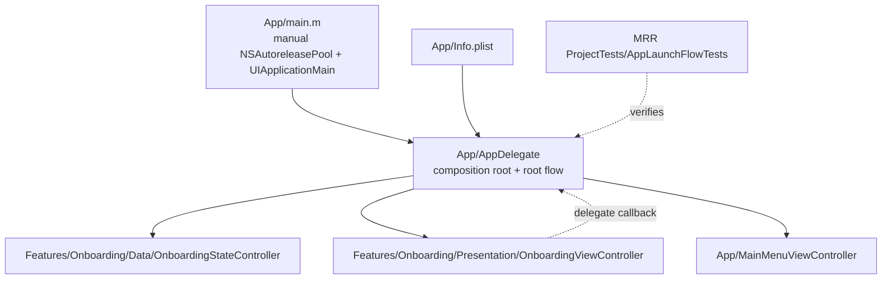
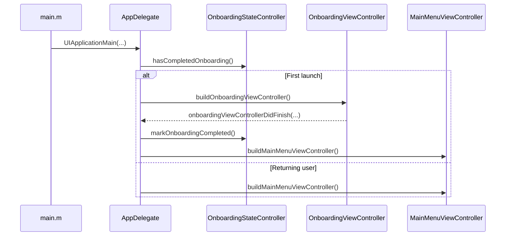
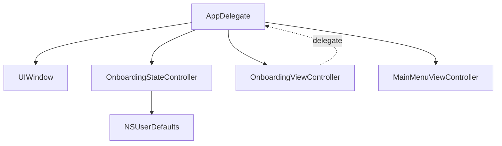
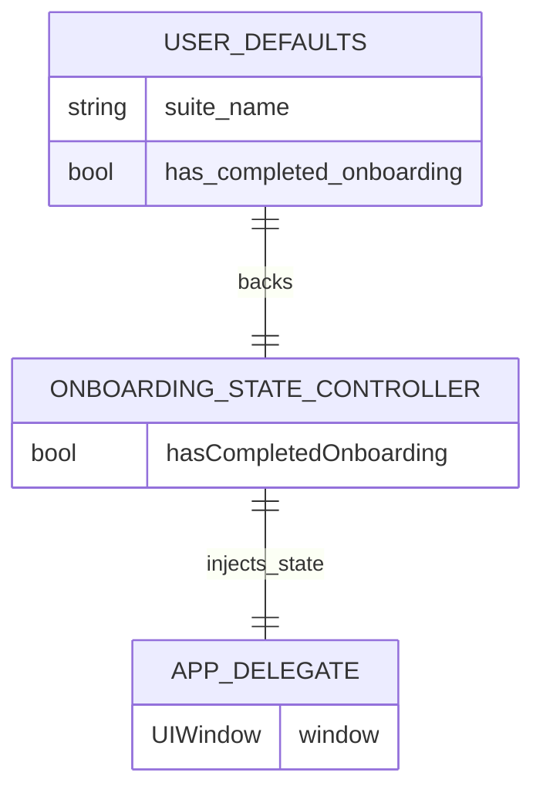
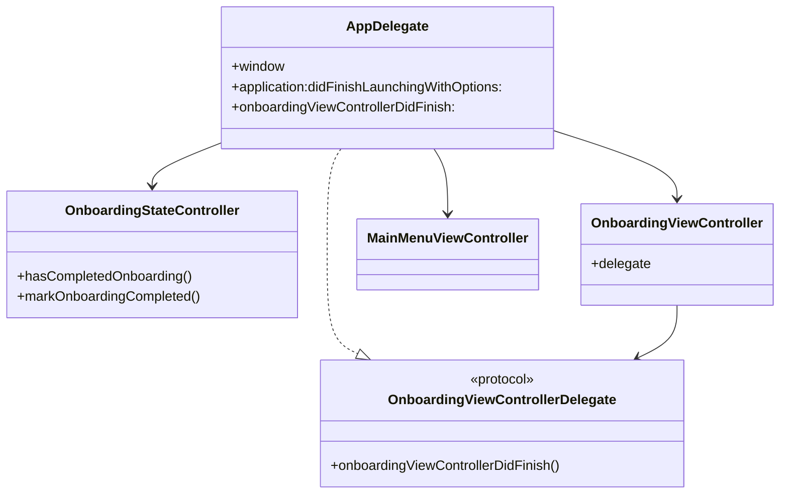
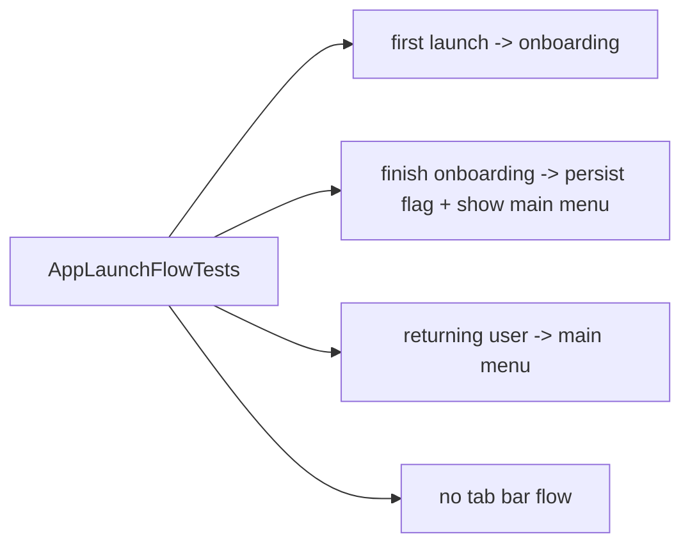

# Architecture Analysis

## Scope

This document reflects the current application after the old demo-learning stack has been fully removed from both the runtime flow and the repository.

The app now contains only two user-facing screens:

- `OnboardingViewController` on first launch
- `MainMenuViewController` after onboarding has been completed

## Executive Summary

The application is a small state-driven iOS app centered on one persisted boolean: whether onboarding has already been completed.

`AppDelegate` is the composition root. It reads onboarding state at launch and decides which root controller should be installed in the window. `OnboardingViewController` reports completion through a delegate callback, and `OnboardingStateController` persists that event to `NSUserDefaults`. Once the flag is stored, future launches go directly to `MainMenuViewController`.

## Top-Level Module Map

## Runtime Flow

## Root Composition Graph

## Persistence ERD

## Object Relationship Diagram

## File Responsibilities

| File | Responsibility | Key relationship |
| --- | --- | --- |
| `MRR Project/App/main.m` | Application bootstrap with manual autorelease pool | Starts UIKit lifecycle |
| `MRR Project/App/AppDelegate.h` | Public app delegate contract | Exposes injectable initializer for tests |
| `MRR Project/App/AppDelegate.m` | Composition root and root-controller switching | Depends on onboarding state and onboarding delegate callback |
| `MRR Project/App/MainMenuViewController.h` | Declares simple post-onboarding screen | No navigation responsibilities |
| `MRR Project/App/MainMenuViewController.m` | Renders simple placeholder main menu | Installed directly as root controller |
| `MRR Project/Features/Onboarding/Data/OnboardingStateController.h` | Declares onboarding persistence API | Used by `AppDelegate` |
| `MRR Project/Features/Onboarding/Data/OnboardingStateController.m` | Stores onboarding completion in `NSUserDefaults` | Single source of persisted launch state |
| `MRR Project/Features/Onboarding/Presentation/ViewControllers/OnboardingViewController.h` | Declares delegate-based onboarding contract | Reports completion upward |
| `MRR Project/Features/Onboarding/Presentation/ViewControllers/OnboardingViewController.m` | Renders simple onboarding UI | Calls delegate on primary button tap |
| `MRR ProjectTests/AppLaunchFlowTests.m` | Verifies launch-state behavior | Covers onboarding, persistence, and main-menu routing |

## Active Dependencies

The runtime dependency chain is intentionally small:

`AppDelegate -> OnboardingStateController -> NSUserDefaults`

`AppDelegate -> OnboardingViewController -> delegate callback -> AppDelegate`

`AppDelegate -> MainMenuViewController`

There is no tab bar, no feature repository graph, and no shared demo infrastructure anymore.

## Testing Coverage

## Architectural Notes

- The app target uses Manual Retain-Release. Application code must continue balancing retained objects explicitly.
- Navigation is state-based, not coordinator-based. This keeps the app small and direct.
- `MainMenuViewController` is an app-level screen, not a feature module.
- The current repository is intentionally narrow: app shell, onboarding state, onboarding UI, and launch-flow tests.

## Conclusion

The current architecture is a minimal two-state application: onboarding for first launch and a simple main menu for all subsequent launches. The object graph is small, the persisted state surface is a single boolean, and `AppDelegate` remains the single orchestration point.
