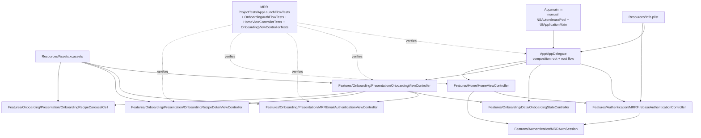
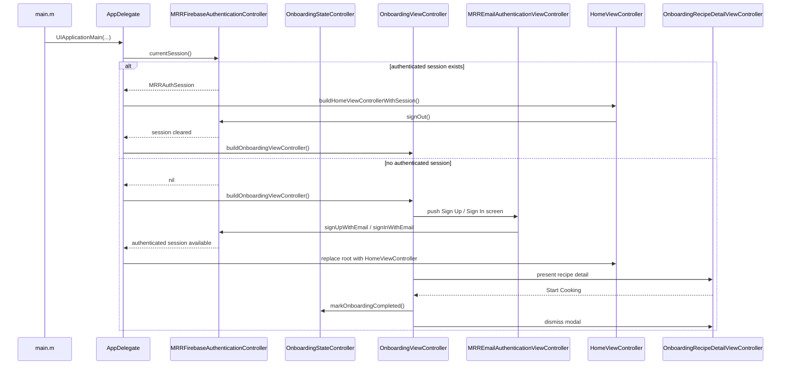
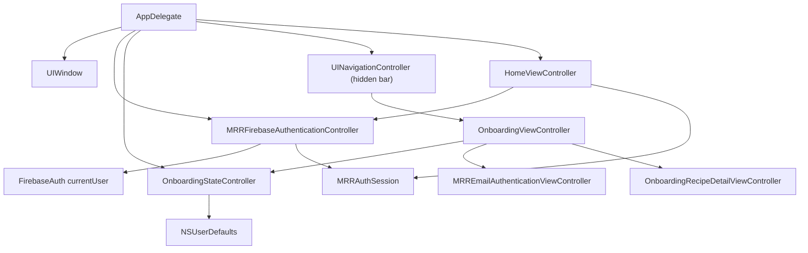
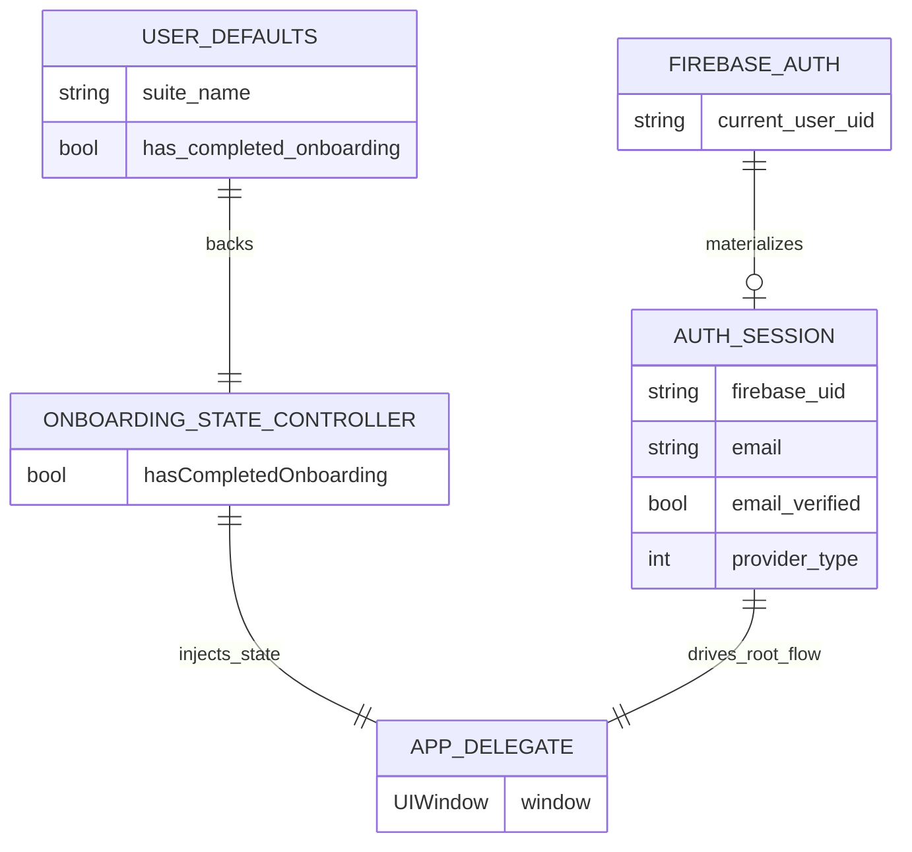
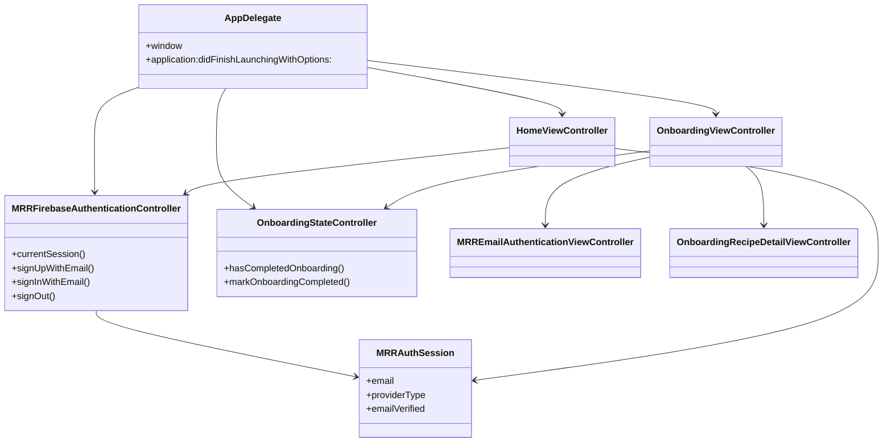
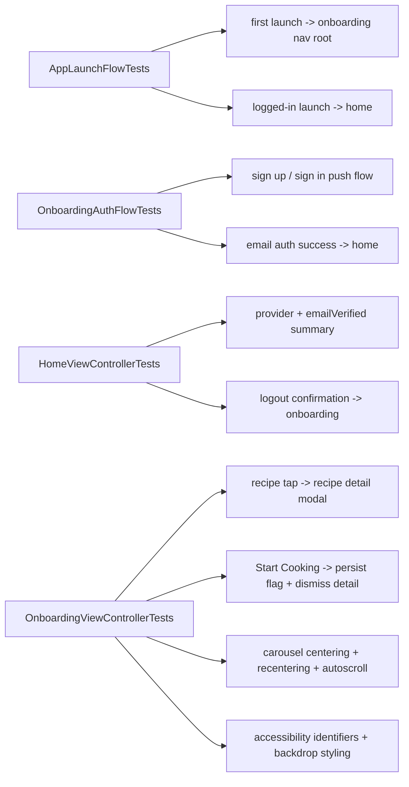

# Architecture Analysis

## Scope

This document reflects the current application after the old `MainMenu` screen was removed and the onboarding flow evolved into an email-first authentication entry point.

The user-facing runtime now contains four main screens:

- `OnboardingViewController` as the logged-out root
- `MRREmailAuthenticationViewController` pushed in either `Sign Up` or `Sign In` mode
- `HomeViewController` as the authenticated root
- `OnboardingRecipeDetailViewController` as a modal recipe-exploration step

The app shell also owns one shared asset catalog:

- `Resources/Assets.xcassets` for `AppIcon`, `OnboardingAppIcon`, named colors, and onboarding recipe imagery

## Executive Summary

The application is a small state-aware iOS app centered on a polished onboarding surface, a Firebase-backed authentication session, and a retained recipe-exploration flow.

`AppDelegate` is the composition root. On launch, it configures Firebase when possible, asks the authentication controller for a current session, and installs either the onboarding navigation stack or the signed-in home screen as the window root. `OnboardingViewController` owns the branded onboarding UI, looping carousel, auth CTA entry points, and recipe-detail presentation. Its email CTAs push `MRREmailAuthenticationViewController`, which handles separate full-screen sign-up and sign-in layouts while keeping that UI under the onboarding feature. `HomeViewController` shows the active session summary, including provider and `emailVerified` state, and delegates sign-out back to the app root.

`OnboardingStateController` still persists whether the recipe flow reached `Start Cooking`, but that flag is now separate from launch routing. The root flow is driven by the auth session instead.

## Top-Level Module Map

## Runtime Flow

## Root Composition Graph

## Persistence ERD

## Object Relationship Diagram

## File Responsibilities

| File | Responsibility | Key relationship |
| --- | --- | --- |
| `MRR Project/App/main.m` | Application bootstrap with manual autorelease pool | Starts UIKit lifecycle |
| `MRR Project/App/AppDelegate.h` | Public app delegate contract | Exposes injectable initializer for tests |
| `MRR Project/App/AppDelegate.m` | Composition root and root-controller installation | Chooses onboarding navigation stack or home based on the current auth session |
| `MRR Project/Resources/Info.plist` | Application metadata and launch configuration | Referenced directly by build settings |
| `MRR Project/Resources/Assets.xcassets` | Shared app icon, named colors, and onboarding illustration | Used by the current programmatic UI |
| `MRR Project/Features/Authentication/MRRAuthenticationController.h` | Auth abstraction used by the app shell and tests | Keeps Firebase behind a mockable interface |
| `MRR Project/Features/Authentication/MRRFirebaseAuthenticationController.m` | Firebase-backed auth implementation | Builds `MRRAuthSession` from `FIRAuth` and handles email auth actions |
| `MRR Project/Features/Authentication/MRRAuthSession.m` | Immutable auth-session value object | Carries `email`, provider, and `emailVerified` into the UI |
| `MRR Project/Features/Authentication/MRRAuthErrorMapper.m` | Maps auth errors into user-facing copy | Shared by onboarding auth and home logout errors |
| `MRR Project/Features/Onboarding/Data/OnboardingStateController.h` | Declares onboarding persistence API | Used by `AppDelegate` |
| `MRR Project/Features/Onboarding/Data/OnboardingStateController.m` | Stores onboarding recipe completion in `NSUserDefaults` | Legacy onboarding state kept separate from auth-based root flow |
| `MRR Project/Features/Onboarding/Presentation/ViewControllers/OnboardingViewController.h` | Declares the onboarding controller initializer | Accepts injected onboarding state |
| `MRR Project/Features/Onboarding/Presentation/ViewControllers/OnboardingViewController.m` | Builds branded onboarding layout, looping carousel, auth CTA entry points, and recipe-detail flow | Owns push-based email auth navigation and launch centering safeguards |
| `MRR Project/Features/Onboarding/Presentation/ViewControllers/MRREmailAuthenticationViewController.m` | Renders full-screen sign-up and sign-in screens | Handles email/password validation, keyboard-aware scrolling, and auth submission |
| `MRR Project/Features/Onboarding/Presentation/ViewControllers/OnboardingRecipeDetailViewController.h` | Declares recipe-detail delegate callbacks | Reports close and `Start Cooking` actions |
| `MRR Project/Features/Onboarding/Presentation/ViewControllers/OnboardingRecipeDetailViewController.m` | Renders modal recipe detail content | Triggers onboarding completion through the onboarding controller |
| `MRR Project/Features/Onboarding/Presentation/Views/OnboardingRecipeCarouselCell.h` | Declares the onboarding carousel cell | Used by `OnboardingViewController` collection view |
| `MRR Project/Features/Onboarding/Presentation/Views/OnboardingRecipeCarouselCell.m` | Renders adaptive recipe cards, shared backdrop styling, and fade mask blending | Provides stable accessibility identifiers per recipe |
| `MRR Project/Features/Home/HomeViewController.m` | Renders the authenticated home summary | Shows provider, email, `emailVerified`, and logout confirmation flow |
| `MRR ProjectTests/AppLaunchFlowTests.m` | Verifies launch-state behavior | Covers onboarding/home root routing and sign-out transitions |
| `MRR ProjectTests/OnboardingAuthFlowTests.m` | Verifies pushed auth-screen behavior | Covers sign-up/sign-in entry, keyboard-aware layout, and auth success transitions |
| `MRR ProjectTests/HomeViewControllerTests.m` | Verifies home summary and logout interactions | Covers accessibility identifiers, email verification label, and logout confirmation |
| `MRR ProjectTests/OnboardingViewControllerTests.m` | Verifies onboarding layout, carousel behavior, detail presentation, and accessibility | Covers centering, recentering, backdrop styling, and completion flow |

## Active Dependencies

The runtime dependency chain is intentionally small:

`AppDelegate -> MRRFirebaseAuthenticationController -> FirebaseAuth currentUser`

`AppDelegate -> OnboardingStateController -> NSUserDefaults`

`AppDelegate -> UINavigationController -> OnboardingViewController -> MRREmailAuthenticationViewController`

`AppDelegate -> HomeViewController`

`OnboardingViewController -> UICollectionView -> OnboardingRecipeCarouselCell`

`OnboardingViewController -> OnboardingStateController`

`OnboardingViewController -> OnboardingRecipeDetailViewController`

`HomeViewController -> MRRAuthSession`

`Assets.xcassets -> OnboardingViewController / OnboardingRecipeDetailViewController / OnboardingRecipeCarouselCell`

There is no tab bar, no standalone post-onboarding menu, and no coordinator layer.

## Testing Coverage

## Architectural Notes

- The app target uses Manual Retain-Release. Application code must continue balancing retained objects explicitly.
- Root navigation is state-based, not coordinator-based. This keeps the app small and direct.
- The onboarding feature now owns the dedicated sign-up and sign-in screens, so auth entry remains visually and structurally close to the onboarding surface.
- Email/password is the only live onboarding auth path in the current milestone. Google and Apple stay visible as structured stubs.
- The onboarding carousel uses virtual looping plus guarded initial positioning so auto-scroll does not jump on launch.
- The auth screens are keyboard-aware: they use scroll insets, tap-to-dismiss, and focused-field visibility handling.
- Light and dark appearance rely on named colors from the shared asset catalog.
- Accessibility identifiers are a maintained part of the onboarding, auth, and home debug/test contract.
- The repository now includes a tracked GitHub Actions coverage workflow and a tracked pre-commit hook for Objective-C formatting and linting.

## Conclusion

The current architecture is a minimal onboarding-and-auth application. `AppDelegate` remains the composition root, `OnboardingViewController` remains the logged-out entry surface, `MRREmailAuthenticationViewController` handles pushed full-screen email auth, and `HomeViewController` represents the authenticated state. The result is a small runtime surface that still keeps the polished carousel, recipe-detail exploration flow, adaptive theming, and a stronger auth/test/tooling story than the earlier onboarding-only variant.
